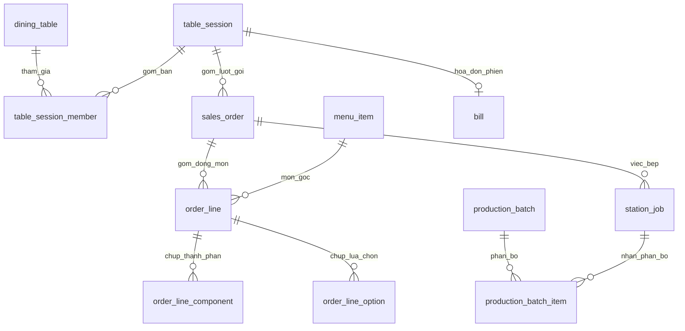

# Nhập môn database của dự án

Dành cho dev mới ra trường vừa tham gia dự án. Mục tiêu là hiểu dữ liệu đang kể
câu chuyện gì, biết tìm bảng liên quan và đọc được một luồng nghiệp vụ trước
khi sửa code. Biên soạn ngày 2026-10-11 từ các file hiện có trong cây làm việc;
một số migration mới đang chưa commit.

Đây là tài liệu học và chỉ đường, không sở hữu schema hay luật nghiệp vụ.
Tên bảng, cột, kiểu và ràng buộc phải kiểm ở [db/migrations/](../../../db/migrations/).
Ý định thiết kế nằm trong [tài liệu database](../../product/2-db/).
Nếu nội dung ở đây lệch nguồn đó, hãy theo nguồn đó và cập nhật hướng dẫn này.

## 1. Dự án cần database để làm gì?

Hệ thống phục vụ bán hàng và quản trị cho một quán ăn. Một lượt khách có thể
gọi nhiều lần, ghép bàn, chọn thêm tùy chọn, trả bằng tiền mặt và chuyển khoản,
hoặc còn nợ. Bếp lại làm theo mẻ, nên một mẻ có thể phục vụ nhiều đơn.

Database cần giữ được cả hiện trạng và lịch sử: khách đã gọi gì, giá nào đã áp,
bếp đã làm bao nhiêu, ai thu tiền và ai sửa dữ liệu. Vì vậy, đây không chỉ là
vài bảng `order` và `product` như bài tập CRUD.

Khi đọc, hãy tách ba câu hỏi: **khách gọi gì**, **bếp làm gì**, **tiền đi đâu**.
Chúng liên quan nhưng có bảng và vòng đời riêng. Ví dụ, hủy đơn không tự có
nghĩa là đã hoàn tiền cho khách.

## 2. Những khái niệm cần nắm trước

Một **bảng** chứa những bản ghi cùng loại. Một **dòng** là một bản ghi; một
**cột** là một thuộc tính. `dining_table` chứa bàn vật lý của quán, còn mỗi dòng
trong `sales_order` là một lượt gọi món.

**Khóa chính** (`PRIMARY KEY`) xác định duy nhất một dòng. Cột `id` thường là
`bigint GENERATED ALWAYS AS IDENTITY`: PostgreSQL sinh số khi thêm dòng.
Đừng suy ra ý nghĩa nghiệp vụ hay yêu cầu số liên tục từ `id`.

**Khóa ngoại** (`FOREIGN KEY`) nối dữ liệu giữa các bảng. Ví dụ,
`order_line.sales_order_id` trỏ đến `sales_order.id`: một đơn có nhiều dòng món,
mỗi dòng thuộc một đơn. Bảng nối như `table_session_member` dùng để biểu diễn
một phiên có nhiều bàn và một bàn được dùng qua nhiều phiên theo thời gian.

**Giao dịch** (`transaction`) gom nhiều câu SQL thành một việc trọn vẹn.
`BEGIN` mở giao dịch, `COMMIT` xác nhận, `ROLLBACK` hủy. Nếu tạo đơn thành công
nhưng ghi dòng món thất bại, ứng dụng phải hủy cả giao dịch để tránh đơn dở dang.

`NULL` nghĩa là không có giá trị, khác số `0` và chuỗi rỗng. Muốn tìm dòng
không có phiên bàn, dùng `IS NULL`, không dùng `= NULL`.

## 3. Môi trường database

Dự án dùng **PostgreSQL 17**, chạy bằng Docker Compose. Cấu hình máy phát triển
nằm ở [compose.yaml](../../../compose.yaml).

| Thành phần | Ý nghĩa |
|---|---|
| Database `banhcuon` | Database làm việc trên máy dev |
| Schema `shop` | Không gian tên chứa bảng nghiệp vụ, ví dụ `shop.sales_order` |
| Vai PostgreSQL `shop_owner` | Chủ schema, dùng chạy migration |
| Vai PostgreSQL `shop_app` | Vai backend dùng đọc, thêm, sửa; không được xoá cứng dữ liệu nghiệp vụ |
| `public.schema_migrations` | Công cụ migration ghi phiên bản đã chạy và trạng thái `dirty` |
| Cổng `127.0.0.1:5433` | Cổng mặc định trên máy dev; có thể đổi qua `DB_PORT` |

Vai PostgreSQL là quyền kết nối database. Nó khác vai nghiệp vụ của người
trong quán, được biểu diễn qua dữ liệu `person` và kiểm quyền ở backend.

Server để UTC; kết nối phải đặt múi giờ của quán tường minh theo
[quy ước code](../../product/2-db/10-quy-uoc-code.md), mục `QC-06`.
Database của bộ kiểm được dựng riêng, không dùng database làm việc của bạn.

## 4. Bản đồ các nhóm bảng

Đọc theo nhóm sẽ dễ hơn đọc mọi migration từ đầu. Bảng dưới đây nêu các bảng
đáng xem trước, không phải danh mục đầy đủ của schema.

| Nhóm | Bảng nên bắt đầu | Dữ liệu được giữ |
|---|---|---|
| Bàn và gọi món | `dining_table`, `table_session`, `table_session_member`, `sales_order`, `order_line`, `qr_code` | Bàn, lượt sử dụng bàn, lượt gọi và dòng món |
| Menu và lựa chọn | `menu_item`, `menu_component`, `menu_item_component`, `option_group`, `menu_option` | Món bán, thành phần của suất và lựa chọn |
| Menu và lựa chọn, phần nối | `menu_item_option_group`, `option_group_prerequisite` | Nhóm lựa chọn áp cho món và điều kiện của nhóm |
| Bản chụp lúc đặt | `order_line_component`, `order_line_option` | Thành phần, tên lựa chọn và phụ thu đã áp cho dòng món |
| Tiền | `bill`, `prepayment`, `prepayment_use`, `debt_collection`, `refund` | Hóa đơn, trả trước, dùng tiền trả trước, thu nợ và hoàn tiền |
| Két theo ngày | `opening_float`, `opening_float_line`, `cash_count`, `cash_count_line`, `reconciled_day` | Tiền đầu ngày, đếm két và dấu đối soát |
| Bếp | `menu_component_station`, `station_job`, `production_batch`, `production_batch_item`, `station_job_transfer`, `wrong_make_note` | Phân trạm, việc bếp, mẻ, phân bổ mẻ, chuyển chủ và ghi nhận làm sai |
| Người và lịch sử | `person`, `counter_duty`, `paper_ledger`, `record_revision` | Người, ca đứng quầy, sổ giấy và vết thay đổi |
| Nguyên liệu | `supply_item`, `supply_day_entry` | Danh mục nguyên liệu và số người nhập theo ngày |
| Chấm công, khoản của người | `attendance_day`, `staff_advance`, `holiday_bonus` | Ô chấm công, ứng tiền và thưởng lễ |
| Gián đoạn nhận đơn | `order_intake_pause`, `shop_blind_spell` | Khoảng dừng nhận đơn và khoảng quán không nhìn được hệ thống |

Lý do và ràng buộc từng nhóm nằm trong các tài liệu lược đồ ở
[docs/product/2-db/](../../product/2-db/). Mảng admin còn có việc chưa dựng;
đừng mặc định mọi chức năng dự kiến đều đã có bảng.

## 5. Hiểu quan hệ qua một lượt khách ăn tại bàn

Sơ đồ sau chỉ thể hiện các quan hệ chính để học; xem migration để biết đầy đủ
khóa ngoại và điều kiện của chúng.



### Bàn vật lý khác phiên bàn

`dining_table` là bàn có nhãn trong quán. `table_session` là một lượt sử dụng
bàn cho đến lúc đóng phiên. Khi khách khác đến cùng bàn đó, họ dùng phiên khác;
lịch sử phiên cũ vẫn còn.

`table_session_member` ghi những bàn thuộc phiên. Nhờ bảng này, ghép hai bàn
không cần tạo hai lượt thanh toán độc lập. Database có unique index có điều
kiện để một bàn không thuộc hai phiên chưa đóng cùng lúc.

### Phiên bàn khác đơn gọi món

Khách gọi lần đầu tạo một `sales_order`; gọi thêm tạo một lượt gọi nữa cùng
phiên. Trong mỗi lượt gọi, `order_line` giữ món, số lượng và dấu mang về của
từng dòng. Vì thế, không nên đếm số `sales_order` rồi coi đó là số lượt khách.

Các kênh gắn bàn là `qr_table` và `staff_pos`. Các kênh `delivery`, `pickup`,
`phone_preorder` tạo đơn không thuộc phiên bàn. Ràng buộc trên `sales_order`
kiểm việc có phiên và bàn phù hợp với kênh.

### Dòng món khác việc bếp

Một suất bán có thể gồm nhiều thành phần. `station_job` biểu diễn nhu cầu bếp
theo trạm và dữ liệu dòng món; `production_batch` ghi mẻ làm thực tế.
`production_batch_item` nối phần của mẻ với việc bếp nhận nó.

Không thể suy ra khách đã được phục vụ chỉ từ việc đơn tồn tại. Hãy đọc nhóm
sản xuất, đặc biệt các ràng buộc số đã làm và số đã ra bàn.

### Đơn khác hóa đơn

`sales_order` trả lời khách gọi gì; `bill` trả lời phần tiền của lần chốt.
Hóa đơn có thể gắn phiên bàn hoặc đơn độc lập theo ràng buộc của schema.
`prepayment` giữ khoản trả trước, `prepayment_use` giữ việc sử dụng khoản đó,
`debt_collection` giữ thu nợ, `refund` giữ hoàn tiền.

Tiền mặt và chuyển khoản được tách để đối soát. Đừng cộng tiền đặt trước với
tiền hóa đơn một cách trực tiếp: phải xét phần trả trước đã được sử dụng để
không tính hai lần. Công thức và ý nghĩa từng khoản ở
[lược đồ đường tiền](../../product/2-db/04-luoc-do-duong-tien.md).

## 6. Vì sao lưu cả tên và giá trong dòng đơn?

`menu_item` là menu hiện hành. `order_line` có `menu_item_id` để biết món gốc,
nhưng còn giữ `item_name`, `unit_price_vnd`, `priced_at`.
Các bảng con giữ bản chụp thành phần và lựa chọn lúc đặt.

Ví dụ giả định để học: khách đặt món giá 30.000 đồng; sau đó menu đổi thành
35.000 đồng. Khi xem lại dòng đơn ấy, phải đọc giá đã lưu trên dòng đơn.
Nếu join menu hiện tại rồi lấy giá hiện tại, lịch sử bán hàng sẽ bị hiểu sai.
Ví dụ này không phải giá menu của quán.

`line_total_vnd` là cột sinh tự động từ `unit_price_vnd * quantity`.
Backend không ghi tay vào cột này. Khi có nghiệp vụ sửa dòng, phải theo luật
khóa giá và ghi vết; bản chụp không có nghĩa là mọi dòng bị cấm sửa vĩnh viễn.

## 7. Quy ước kiểu dữ liệu đáng nhớ

| Dạng cột | Cách hiểu |
|---|---|
| `id`, hậu tố `_id` | Khóa chính và khóa ngoại kiểu `bigint` |
| Hậu tố `_vnd` | Tiền nguyên đồng bằng `bigint`, không dùng số thực |
| Hậu tố `_at` | Thời điểm bằng `timestamptz` |
| `sale_date` | Ngày bán bằng `date`, có ý nghĩa nghiệp vụ riêng |
| `status`, `code`, hậu tố `_code` | Mã máy đọc dạng `text`, phân biệt hoa thường |
| Hậu tố `_measure` | Lượng có thể lẻ bằng `numeric`; không phải kiểu tiền |
| Hậu tố `_image` | Bản chụp dòng dạng `jsonb` trong vết thay đổi |

`timestamptz` biểu diễn một thời điểm; cách hiển thị phụ thuộc múi giờ kết nối.
`sale_date` là ngày nghiệp vụ. Đừng mặc định dùng `created_at::date` cho mọi
báo cáo: khoản thu nợ hay nhập lại từ sổ giấy có thể có mốc ghi khác ngày mà
nghiệp vụ muốn tính. Đọc [quy ước dữ liệu](../../product/2-db/01-quy-uoc-du-lieu.md)
và [thời gian, ngày bán](../../product/1-system-design/02-thoi-gian-ngay-ban.md).

## 8. Database tự bảo vệ dữ liệu như thế nào?

`NOT NULL` bắt buộc có giá trị. `CHECK` kiểm điều kiện trên dòng, chẳng hạn
số lượng phải dương. `UNIQUE` ngăn trùng; unique index có điều kiện có thể chỉ
ngăn trùng ở những dòng còn hoạt động. Khóa ngoại buộc dữ liệu liên quan tồn tại
và, với khóa nhiều cột, buộc cả tổ hợp giá trị khớp nhau.

Một số khóa ngoại là `DEFERRABLE INITIALLY DEFERRED`: chúng được kiểm ở lúc
`COMMIT`. Ví dụ, dòng món và tập thành phần đầy đủ phải được ghi trong cùng
giao dịch. Một câu `INSERT` chạy được chưa chứng minh giao dịch cuối cùng hợp lệ.

**Trigger** là logic PostgreSQL tự chạy khi thêm hoặc sửa dòng. Dự án dùng
trigger cho các luật vượt quá một `CHECK`, bao gồm ghi vết và bảo vệ dữ liệu
ngày đã đối soát. Vì vậy, khi đọc `\d` của bảng, hãy xem cả phần trigger và hàm
mà trigger gọi.

**Khóa khi giao dịch chạy** ở backend giúp các thao tác đồng thời không cùng
đọc trạng thái cũ rồi ghi kết quả xung đột. Kiểm dữ liệu trước khi ghi ở Go
không thay thế được ràng buộc database hay khóa cần thiết.

Các luật bắt buộc có mã `I-...`, các quy ước dữ liệu có mã `QD-...`, quy ước
code có mã `QC-...`. Đây là mã để lần về tài liệu và phép kiểm, không phải tên
bảng. Xem [quality/invariants.md](../../../quality/invariants.md) khi cần biết
một luật bảo vệ điều gì.

### Vết thay đổi và không xoá cứng

`record_revision` giữ đối tượng bị đổi, bản trước, bản sau, lý do và người
thực hiện. Migration chế độ nghiêm hiện có trong cây làm việc buộc các lần sửa
thuộc cơ chế này khai `shop.revision_reason` và `shop.actor_person_id` trong
giao dịch; có ngoại lệ hẹp cho luồng khách QR. Đọc
[lược đồ người và vết](../../product/2-db/06-luoc-do-nguoi-va-vet.md) và migration
liên quan trước khi thêm đường ghi.

Không xoá cứng dữ liệu nghiệp vụ nghĩa là dùng trạng thái hoặc dấu hủy theo
từng bảng. Nó không có nghĩa mọi bảng đều có `deleted_at`, và không thay thế
cho cơ chế sao lưu.

## 9. Tự mở database và đọc thử

Chạy từ thư mục gốc repo, với Docker đang hoạt động:

```bash
make setup
make psql
```

`make setup` bật database, chạy migration và nạp dữ liệu mồi. Cách chạy chi tiết
và xử lý lỗi ở [chạy database trên máy](../../guideline/chay-database-tren-may.md).
Các ví dụ dưới đây chỉ đọc; database mới nạp mồi có thể chưa có đơn bán hàng.

Trong `psql`, thử:

```text
\dt shop.*
\d shop.sales_order
\d shop.order_line
\x auto
```

Xem phiên bản, múi giờ và sổ migration:

```sql
SELECT version();
SHOW TimeZone;
SELECT version, dirty FROM public.schema_migrations;
```

Đọc các dòng món gần đây bằng dữ liệu đã chụp:

```sql
SELECT o.id AS order_id, o.channel_code, o.status,
       l.id AS line_id, l.item_name, l.quantity,
       l.unit_price_vnd, l.line_total_vnd, l.priced_at
FROM shop.sales_order AS o
JOIN shop.order_line AS l ON l.sales_order_id = o.id
ORDER BY o.id DESC, l.id
LIMIT 30;
```

Xem bàn nào đang thuộc phiên chưa đóng:

```sql
SELECT t.label, s.id AS session_id, s.status
FROM shop.table_session_member AS m
JOIN shop.dining_table AS t ON t.id = m.dining_table_id
JOIN shop.table_session AS s ON s.id = m.table_session_id
WHERE NOT m.session_closed
ORDER BY t.label;
```

Hai truy vấn minh họa các bẫy thường gặp. Truy vấn dòng món không lấy tên từ
menu hiện tại. Truy vấn bàn đang dùng không chỉ kiểm `status = 'open'`, vì
phiên đang phục vụ hoặc chờ thanh toán cũng chưa đóng.

Gõ `\q` để thoát. `make stop` giữ dữ liệu; `make reset` xoá sạch database làm
việc rồi dựng lại, nên chỉ dùng khi chủ động muốn bỏ dữ liệu trên máy dev.

## 10. Migration và các lớp kiểm

**Migration** là một bước thay đổi schema có phiên bản. Dự án dùng
golang-migrate; tên file có mốc giờ và cặp `.up.sql` / `.down.sql`.
File `up` áp thay đổi, file `down` chứa đường lùi có khóa chặn để không gỡ dữ
liệu đã có. Migration đã commit phải được thay đổi bằng migration mới.

Để áp migration còn thiếu trên database dev:

```bash
make migrate
```

Nếu migration báo `dirty`, đọc
[thứ tự migration và xử lý lỗi](../../product/2-db/07-thu-tu-migration.md).
`force` chỉ điều chỉnh dấu phiên bản, không tự sửa schema bị sai.

Các lớp kiểm có mục đích khác nhau:

| Lệnh hoặc thư mục | Giúp chứng minh điều gì? |
|---|---|
| `db/tests/` | Các tình huống đúng và tình huống bị database từ chối |
| `db/seed/seed.pl` | Sinh dữ liệu mồi từ nguồn dữ kiện quán |
| `db/reconcile/` | Tìm dữ liệu vi phạm trong database đang có |
| `db/reconcile/proof/` | Cố tình dựng sai để chứng minh phép đối chiếu biết phát hiện |
| `db/scenario/` | Diễn chuỗi nghiệp vụ qua nhiều giao dịch và đọc lại |
| `./scripts/db-check.sh` | Dựng database riêng, chạy bộ kiểm database |
| `./scripts/reconcile.sh` | Đối chiếu dữ liệu database làm việc; kết quả rỗng của từng phép là đạt |
| `./scripts/be-check.sh` | Kiểm backend với database theo khung của repo |
| `./scripts/gate.sh` | Chạy các cổng phù hợp với thay đổi; có thể bỏ qua build/test khi chỉ sửa tài liệu |

Một phép đối chiếu không thấy lỗi chưa chứng minh mọi luồng ghi đều đúng.
Test luồng, ràng buộc database và đối chiếu bổ sung cho nhau. Không chạy file
test SQL trực tiếp trên database chứa dữ liệu cần giữ; dùng script bộ kiểm.

## 11. Lộ trình đọc cho tuần đầu

1. Dựng database, liệt kê bảng và xem cấu trúc `sales_order`, `order_line`.
   Mục tiêu là phân biệt database, schema, bảng và ràng buộc trên bảng.
2. Đọc [lược đồ bán hàng](../../product/2-db/02-luoc-do-ban-hang.md) và
   [lược đồ menu, giá](../../product/2-db/03-luoc-do-menu-gia.md), rồi lần sang
   migration tương ứng. Tự giải thích vì sao một phiên có nhiều lượt gọi.
3. Đọc [lược đồ tiền](../../product/2-db/04-luoc-do-duong-tien.md) và
   [lược đồ sản xuất](../../product/2-db/05-luoc-do-san-xuat.md).
   Tự phân biệt đơn, việc bếp, mẻ và hóa đơn.
4. Chọn một test ở `db/tests/`, đọc cách dựng dữ liệu và lỗi mong đợi.
   Sau đó chạy bộ kiểm bằng script để thấy ràng buộc được kiểm thật.
5. Lần một cửa ghi từ backend trong [be/internal/](../../../be/internal/):
   tìm giao dịch, câu SQL, dữ liệu người thực hiện và cách xử lý lỗi database.
   Đối chiếu với [vai và quyền](../../product/3-be/02-vai-va-quyen.md).

Trước lần sửa đầu tiên, hãy trả lời được: dữ liệu thuộc bảng nào, thao tác cần
bao nhiêu câu SQL trong cùng giao dịch, có giữ lịch sử và giá cũ không, và
test nào sẽ phát hiện nếu sửa sai. Nếu cần quyết luật nghiệp vụ còn chưa rõ,
hãy hỏi người phụ trách thay vì tự lấp chỗ trống bằng code.
