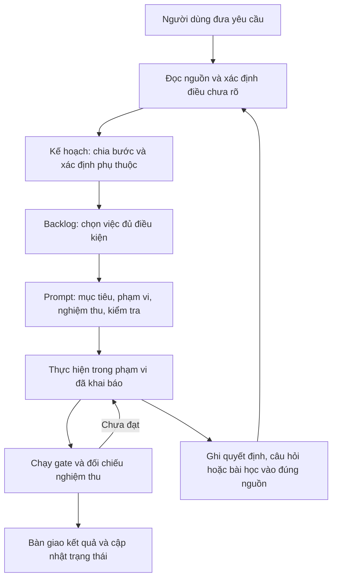

# Hiểu hệ thống Lean AI Engineering System

Tài liệu giải thích dành cho người mới đọc repo, viết ngày 2026-09-24 theo yêu cầu của chủ repo. Đây là bản hướng dẫn đọc, không phải nơi chốt nghiệp vụ, kiến trúc hay trạng thái công việc. Khi cần quyết định hoặc triển khai, hãy mở nguồn được liên kết trong từng phần; bảng nguồn chính thức nằm ở [CLAUDE.md §2](../../CLAUDE.md#2-source-of-truth).

## 1. Hệ thống này làm gì?

Repo này tổ chức cách **người và AI cùng phát triển một phần mềm qua nhiều phiên làm việc**. Nó giữ yêu cầu, quyết định, công việc và bằng chứng kiểm tra trong các file để phiên sau có thể tiếp tục mà không phải dựa vào trí nhớ của cuộc trò chuyện trước.

Cần phân biệt hai lớp:

| Lớp | Mục đích | Nơi bắt đầu đọc |
|---|---|---|
| Bộ quy trình Lean AI Engineering | Quy định cách nhận việc, tìm nguồn đúng, giới hạn thay đổi, kiểm tra và bàn giao | [CLAUDE.md](../../CLAUDE.md), [README gốc](../../README.md) |
| Dự án đang áp dụng quy trình | Xây dựng hệ thống bán hàng và quản trị cho quán Bánh cuốn Bà Thanh Cao Bằng | [Dữ kiện quán](../../master_plan/shop-facts.md), [Mục lục sản phẩm](../product/00-index.md) |

Vì vậy, thấy nhiều tài liệu và script kiểm tra không có nghĩa ứng dụng bán hàng đã hoàn thành. Tài liệu thiết kế mô tả thứ phải xây; mã triển khai, kiểm thử và kết quả chạy mới chứng minh thứ đã hoạt động.

## 2. Vì sao cần nhiều loại file?

Mỗi loại file trả lời một câu hỏi khác nhau. Nguyên tắc trung tâm là **một sự thật có một nơi sở hữu**. “Owner” trong ngữ cảnh này thường là file có thẩm quyền chứa thông tin ấy, không phải người được giao việc.

| Bạn muốn biết | Đọc ở đâu | Hiểu vai trò của nó |
|---|---|---|
| Quán thực sự vận hành thế nào? | [shop-facts.md](../../master_plan/shop-facts.md) | Dữ kiện nghiệp vụ của quán |
| Phần mềm phải xử lý thế nào? | [docs/product](../product/00-index.md) | Hành vi được đặc tả theo pha và mảng |
| Các phần của hệ thống liên hệ thế nào? | [architecture.md](../product/1-system-design/architecture.md) | Cấu trúc và ranh giới trách nhiệm |
| Vì sao chọn cách này? | [decisions.md](../decisions.md) | Quyết định cùng lý do, thường mang mã ADR |
| Điều gì luôn phải đúng? | [invariants.md](../../quality/invariants.md) | Các bất biến nghiệp vụ cần bảo vệ |
| Còn điều gì chưa biết? | [99-unknowns.md](../product/99-unknowns.md) | Câu hỏi chưa được trả lời và phần việc bị ảnh hưởng |
| Làm bước nào trước, đầu ra là gì? | [Kế hoạch DB](../../master_plan/DB_master_plan_banh_cuon_ba_thanh.md) là một ví dụ | Kế hoạch và phụ thuộc của một pha |
| Việc nào sẵn sàng, đang làm, đã xong? | [backlog.md](../../work/backlog.md) | Trạng thái chính thức của mọi task |
| Một bước DB có ý nghĩa và cách làm gì? | [backlog_DB.md](../../work/backlog_DB.md) | Mô tả dài của công việc pha DB |
| Giao cho AI một việc cụ thể thế nào? | [prompt-guideline.md](../prompt-guideline.md), [prompt DB](../../prompt/DB/README.md) | Cách viết và nơi chứa prompt để thực hiện task |
| Lượt này được sửa file nào? | [scope.txt](../../work/scope.txt) | Phạm vi thay đổi đang khai báo |
| Lỗi nào đáng rút kinh nghiệm? | [findings.md](../../work/findings.md) | Vấn đề và bài học có giá trị cho những lần sau |
| Chứng minh kết quả đúng thế nào? | [review-gate.md](../../quality/review-gate.md), [gate.sh](../../scripts/gate.sh) | Cách review và các kiểm tra tự động |

Ví dụ: backlog nói một bước đã xong không có nghĩa backlog trở thành nơi giữ thiết kế dữ liệu của bước ấy. Thiết kế phải ở tài liệu sở hữu nó; backlog chỉ giữ trạng thái và đường dẫn để tìm đến kết quả.

## 3. Từ yêu cầu đến kết quả: đường đi của công việc

Sơ đồ dưới đây mô tả luồng thông tin, không có nghĩa mỗi task đều phải tạo mới tất cả các loại tài liệu.



Một yêu cầu lớn phải được chia thành các kết quả nhỏ có thể kiểm chứng. Mỗi bước nhận đầu vào từ bước trước và tạo đầu ra cho bước sau. Chưa đủ dữ kiện thì ghi rõ phần thiếu; AI không được biến suy đoán thành luật của quán.

## 4. Các pha phát triển có quan hệ gì?

Theo [mục lục sản phẩm](../product/00-index.md), dự án được tổ chức từ BA, thiết kế hệ thống, cơ sở dữ liệu, backend, frontend đến triển khai/vận hành. Đây là cách chia trách nhiệm của tài liệu và công việc, không phải khẳng định mọi pha đều đã có sản phẩm hoàn chỉnh.

| Pha | Câu hỏi chính |
|---|---|
| BA — phân tích nghiệp vụ | Ai dùng, cần làm gì, luật nào chi phối hành vi? |
| System design — thiết kế hệ thống | Thành phần nào chịu trách nhiệm, bảo vệ các luật ở đâu? |
| DB — cơ sở dữ liệu | Biểu diễn, lưu giữ và ràng buộc dữ liệu thế nào? |
| Backend | Thực thi nghiệp vụ và cung cấp hợp đồng giao tiếp thế nào? |
| Frontend | Người dùng nhìn thấy và thao tác thế nào? |
| DevOps | Triển khai và vận hành hệ thống thế nào? |

Ranh giới pha ngăn AI chốt chi tiết quá sớm. Ví dụ, thiết kế hệ thống có thể yêu cầu bảo vệ một bất biến, nhưng không tự đặt tên bảng thay cho pha DB. Pha DB thiết kế dữ liệu, nhưng không tự chốt endpoint thay cho backend. Xem quy tắc chính thức ở [CLAUDE.md §2](../../CLAUDE.md#2-source-of-truth).

Một số luồng có thể tiếp tục thu thập nghiệp vụ trong khi pha kỹ thuật tiến lên. Điều đó không tự động cho phép thi công phần còn thiếu luật. Phụ thuộc cụ thể phải đọc ở kế hoạch và backlog.

## 5. Đọc hai file bạn đang mở như thế nào?

### `backlog_DB.md`: hiểu một bước trước khi làm

Hãy đọc theo đường sau:

1. Mở [kế hoạch DB](../../master_plan/DB_master_plan_banh_cuon_ba_thanh.md) để hiểu đầu ra, thứ tự và điều kiện phụ thuộc.
2. Mở [backlog chính](../../work/backlog.md) để xem bước đó có sẵn sàng nhận hay không.
3. Mở [backlog DB](../../work/backlog_DB.md) để hiểu lý do tồn tại, cách hoàn thành và nguồn phải đọc.
4. Theo liên kết đến prompt của bước khi prompt đã được viết; đó là nơi giữ Acceptance và Verify của bước.

Không nên đọc số thứ tự task rồi mặc định cứ tăng dần là làm được. Điều quyết định là quan hệ phụ thuộc trong kế hoạch. Cũng không nên hiểu cột “Mở/Đóng” của mục lục backlog DB như trạng thái Ready/In Progress/Done: phần đầu file giải thích rõ hai cách ghi này có vai trò khác nhau.

**Ví dụ tra cứu tại ngày 2026-09-24:** backlog chính đang đưa P2-03 vào Ready, còn P2-01 và P2-02 đã Done. Đây chỉ là ví dụ về cách tra, không phải bảng tiến độ được duy trì ở tài liệu này. Khi bắt đầu phiên mới, đọc lại backlog chính và chạy brief.

### `findings.md`: hiểu hệ thống đã học được gì

Finding ghi một vấn đề hoặc bài học có giá trị lâu dài. Nó khác với task: finding giải thích cái gì hỏng và vì sao cần tránh lặp lại; task xác định việc sẽ làm để xử lý.

Khi đọc một finding, tìm vấn đề được ghi nhận, bằng chứng, trạng thái và liên kết đến cách xử lý. Một finding đang mở có thể chặn task Ready; lúc đó cần xử lý phần chặn trước. Không phải mọi lỗi nhỏ hay quan sát thoáng qua đều cần thêm finding.

Ví dụ về quan hệ giữa các loại hồ sơ: phát hiện nhiều tài liệu chép cùng một luật và dần mâu thuẫn → ghi bài học ở finding → nếu cần, mở task sửa → cập nhật luật ở đúng owner và sửa các liên kết → kiểm tra lại. Finding giữ bài học, không trở thành bản mới của luật nghiệp vụ.

## 6. Một phiên làm việc thực tế diễn ra thế nào?

**Bắt đầu:** Claude Code đọc [CLAUDE.md](../../CLAUDE.md); Codex đi qua [AGENTS.md](../../AGENTS.md) để đọc cùng bộ luật. Claude nhận brief qua hook đã cấu hình; Codex chạy lệnh dưới đây từ thư mục gốc repo:

```bash
./scripts/brief.sh
```

Brief cho biết việc đang làm, việc Ready, scope, finding, câu hỏi mở và thay đổi chưa commit. Nó chỉ đường tới nguồn. Nếu có thông báo danh sách bị cắt, cần mở nguồn để đọc phần còn lại.

**Nhận việc:** chọn task người dùng chỉ định hoặc theo thứ tự quy định trong backlog. Với L1 trở lên, ghi trạng thái In Progress, xác định tiêu chí nghiệm thu trước khi sửa và khai báo scope. Chỉ nạp các tài liệu liên quan đến việc đó.

**Thực hiện:** sửa đúng phạm vi; nếu cần mở rộng thì cập nhật scope và giải thích. Khi gặp lựa chọn thiết kế, câu hỏi nghiệp vụ hoặc bài học lâu dài, ghi vào đúng loại hồ sơ. Các thay đổi có sẵn của người khác cần được giữ nguyên.

**Kiểm chứng:** chạy gate, đọc diff và đối chiếu từng tiêu chí nghiệm thu với bằng chứng. Gate xanh là một phần bằng chứng; nó không tự xác nhận mọi câu nghiệp vụ đều đúng.

```bash
./scripts/gate.sh
```

**Bàn giao:** cập nhật trạng thái đúng thực tế, gỡ phần scope của task đã hoàn thành, báo kết quả kiểm tra và phần còn thiếu. Theo quy ước repo, AI chuẩn bị khối lệnh commit; người dùng quyết định thực hiện commit.

Khi đổi giữa Claude Code và Codex, ghi bàn giao trong entry task hiện có theo
[CLAUDE.md §7.4](../../CLAUDE.md#74-claude-code--codex-handoff-and-independent-review).
Một bên thực hiện, bên kia review trên diff ổn định; mỗi worktree chỉ có một bên
sửa. Reviewer đối chiếu acceptance và nguồn, không dựa vào lời báo đã xong.

## 7. “Gate” kiểm tra được đến đâu?

Chuỗi chạy tay hiện tại được xác định trong [gate.sh](../../scripts/gate.sh):

| Kiểm tra | Mục đích | Giới hạn cần hiểu |
|---|---|---|
| Scope | Phát hiện file thay đổi ngoài phạm vi | File chưa được Git theo dõi ngoài scope chỉ tạo ghi chú, nên vẫn phải đọc output |
| Links | Kiểm tra đường dẫn trong tài liệu thuộc vùng được chấm | Đường dẫn tồn tại chưa chắc nội dung được dẫn là đúng |
| Doc status | Bắt một số dạng mâu thuẫn trạng thái trong tài liệu | Không hiểu toàn bộ ý nghĩa của mọi câu văn |
| Phase boundary | Bắt các mẫu vượt ranh giới pha trong vùng thiết kế hệ thống và DB | Chỉ bắt mẫu đã định nghĩa, vẫn cần người review |
| Verify | Chạy kiểm tra mã và test theo những thành phần hiện diện trong repo | Bỏ qua khi lượt chỉ thay đổi tài liệu |

Ngoài chuỗi trên, kiểm tra bàn giao commit chạy trong chế độ hook; kiểm tra subject commit là hook Git riêng. Cấu hình hook của Claude Code nằm ở [.claude/settings.json](../../.claude/settings.json). Codex chủ động chạy gate; lệnh chạy tay không kiểm tra khối commit (Gate 7/7b). Phần đó cần tự đối chiếu theo [CLAUDE.md §6.1](../../CLAUDE.md#61-hand-over-the-commit-ready-to-paste), kể cả file mới và file đã stage từ trước.

Ví dụ về giới hạn: mọi link đều mở được nhưng AI tự chọn một luật chưa được chủ quán trả lời thì kết quả vẫn sai. Máy giúp bắt lỗi có hình dạng rõ ràng; người review phải đối chiếu nội dung với yêu cầu và nguồn nghiệp vụ.

## 8. Vì sao có L0, L1, L2, L3?

Mức công việc được chọn theo hậu quả nếu làm sai, không theo số dòng sửa. Quy định chi tiết ở [README gốc](../../README.md) và [hướng dẫn prompt](../prompt-guideline.md).

| Mức | Cách hiểu | Mức chuẩn bị điển hình |
|---|---|---|
| L0 | Thay đổi cơ học, rủi ro thấp | Sửa, kiểm tra, bàn giao |
| L1 | Việc nhỏ và cô lập | Task, scope, tiêu chí nghiệm thu, kiểm chứng |
| L2 | Ảnh hưởng nghiệp vụ, dữ liệu hoặc hợp đồng | Thêm ràng buộc và bất biến cần bảo vệ; ghi quyết định khi cần |
| L3 | Thiết kế lớn hoặc thay đổi rủi ro cao | Thiết kế và review trước, ghi quyết định, chia thành task nhỏ |

Chỉ sửa một dòng liên quan đến tiền vẫn có thể cần mức kiểm soát cao. Ngược lại, một sửa lỗi chính tả không cần sinh thêm thiết kế và quyết định kiến trúc.

## 9. Cách tự đọc repo mà không bị ngợp

Đọc tài liệu này để có bản đồ, rồi đọc [CLAUDE.md](../../CLAUDE.md) để hiểu quy tắc chính thức. Muốn hiểu sản phẩm, đi từ [dữ kiện quán](../../master_plan/shop-facts.md) sang [mục lục sản phẩm](../product/00-index.md). Muốn tiếp tục công việc, chạy brief rồi theo task trong [backlog chính](../../work/backlog.md).

Nếu muốn thấy một ví dụ đã diễn ra, xem [một task P1-12 chạy thật](../work-flow-session/vi-du-mot-task-chay-that-P1-12.md). Hãy dùng nó để hiểu cách làm; trạng thái hôm nay vẫn phải đọc từ backlog.

Các bản đề xuất dưới `work/proposals/` không tự trở thành thiết kế được chấp nhận. [docs/product.md](../product.md) là bản lưu trước khi tách tài liệu, không còn sở hữu sự thật. Khi hai chỗ nói khác nhau, quay lại bảng owner trong CLAUDE.md thay vì chọn câu có vẻ chi tiết hơn.
